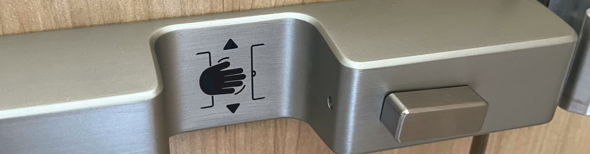

# SmartStall_API



# SmartStall Bluetooth Peripheral & Central Hub Architecture

This repository documents two related layers of the SmartStall ecosystem:

1. The **Bluetooth GATT Peripheral API** implemented by each SmartStall lock device.
2. The **Multi‑Device Central Hub Architecture** (reference implementation currently in Particle firmware) that discovers, polls, and publishes data from multiple SmartStall peripherals in a round‑robin schedule.

If you are integrating a custom hub (ESP32, Linux gateway, etc.), start with the Peripheral API. If you are extending or re‑implementing the hub behavior (scheduling, retries, cloud publishing), also review the Central Hub section below.

> Terminology: "Peripheral" = the SmartStall lock. "Hub" / "Central" = a BLE central client that cycles through multiple peripherals.

---

## Peripheral Overview

Each SmartStall device is a Bluetooth Low Energy (BLE) peripheral advertising a custom primary service. The GATT service exposes:
- BLE device name **SmartStall**
- Stall lock **status** (enum values)
- **Reference Switch** (mechanical position sensor)
- **Battery voltage** (millivolts)
- (New) **Sensor Counts** (aggregate internal diagnostic counters) – optional / emerging field

> **Note:** The Bluetooth MAC address of the SmartStall device is not exposed inside a characteristic; it is the standard BLE address. A 6‑byte Device ID (MAC) is used by hubs for identity.

---

## GATT Service Overview (Peripheral)

- **Service UUID**: `c56a1b98-6c1e-413a-b138-0e9f320c7e8b`
- **Characteristics** (current + emerging):

| Characteristic         | UUID                                    | Properties | Type                     | Description                                                                 |
|------------------------|-----------------------------------------|------------|--------------------------|-----------------------------------------------------------------------------|
| Stall Status           | `47d80a44-c552-422b-aa3b-d250ed04be37`  | `READ`     | `uint16_t`               | Current logical stall/lock state (see Enums).                               |
| Reference Switch       | `2f8a5c10-8d9e-4b7f-9c11-0d2e5b7a4f22`  | `READ`     | `uint8_t`                | Mechanical position: 0 = UNLOCKED, 1 = LOCKED.                              |
| Battery Voltage (mV)   | `7d108dc9-4aaf-4a38-93e3-d9f8ff139f11`  | `READ`     | `uint16_t`               | Most recent battery voltage (millivolts).                                   |
| Sensor Counts (diag) * | `3e4a9f12-7b5c-4d8e-a1b2-9c8d7e6f5a4b`  | `READ`     | 3 × `uint32_t`           | (Optional / future) Diagnostic counters (limit, IR, hall).                  |

*Sensor Counts characteristic is implemented in the current reference hub firmware expectations; peripheral rollout may be staged. Hubs should tolerate absence (graceful discovery failure without aborting other reads).

---

## Characteristics

### 🟦 Stall Status

- **UUID**: `47d80a44-c552-422b-aa3b-d250ed04be37`  
- **Properties**: `READ`  
- **Format**: `uint16_t`  
- **Description**: Logical state summarizing firmware mode & lock condition.

#### Enum Values (Current Public Peripheral Set)

| Value | Name             | Description                                         |
|------:|------------------|-----------------------------------------------------|
| `1`   | `STATE_INIT`     | Device boot / initialization                        |
| `2`   | `STATE_LOCKED`   | Stall is physically locked                          |
| `3`   | `STATE_UNLOCK`   | Stall has been unlocked                             |
| `4`   | `STATE_OPEN`     | Stall door detected open                            |
| `5`   | `STATE_CLOSED`   | Stall door detected closed                          |
| `6`   | `STATE_SLEEP`    | Entering / in low-power mode                        |
| `7`   | `LOCK_TIMEOUT`   | Lock operation timed out                            |
| `8`   | `LOW_BATT`       | Battery too low to operate                          |

---

### 🟨 Reference Switch

- **UUID**: `2f8a5c10-8d9e-4b7f-9c11-0d2e5b7a4f22`  
- **Properties**: `READ`  
- **Format**: `uint8_t` (boolean-like)  
- **Description**: Hardware reference indicating the **actual mechanical position** of the lock, independent of software state.

#### Values

| Value | Meaning      |
|------:|--------------|
| `0`   | UNLOCKED     |
| `1`   | LOCKED       |

> Use this to cross-check `Stall Status` or for safety interlocks.

---

### 🟩 Battery Voltage

- **UUID**: `7d108dc9-4aaf-4a38-93e3-d9f8ff139f11`  
- **Properties**: `READ`  
- **Format**: `uint16_t`  
- **Units**: Millivolts (mV)  
- **Description**: Most recent measured battery voltage of the device (typically measured at boot).

> Example: `4910` → `4.910 V`

### 🟪 Sensor Counts (Diagnostic / Optional)

- **UUID**: `3e4a9f12-7b5c-4d8e-a1b2-9c8d7e6f5a4b`  
- **Properties**: `READ`  
- **Format**: `uint32_t[3]` (little-endian sequence)  
- **Order**: `limit_switch`, `ir_sensor`, `hall_sensor`  
- **Description**: Accumulated internal counts useful for analytics & health monitoring. If characteristic not present, hubs should skip without failing the entire poll.

---

## Central Hub Architecture (Reference Implementation)

The Particle-based hub firmware (v1.1.0) implements a deterministic **single‑shot multi‑device polling loop** designed for scalability and predictable cloud event usage.

### Design Highlights

| Aspect | Strategy |
|--------|----------|
| Discovery | Opportunistic light scan every 15 s + full scan every 60 s when idle |
| Registry | In‑RAM entries: lastSeen, lastRead, failureCount (capacity ≈ 12 devices) |
| Poll Model | Round‑robin; connect → discover → read (status, battery, sensor counts if present) → publish → disconnect |
| Connection Attempts | Up to 3 rapid attempts (≈250 ms spacing) |
| Connect Timeout | 10 s (reduced from earlier 15 s) |
| Characteristic Reads | Each with up to 3 retries (≈150 ms spacing) |
| Backoff | Dynamic extension after consecutive failures (post-threshold) |
| Stale Skip | Devices unseen >120 s temporarily skipped |
| Event Emission | Single consolidated JSON event per successful poll (`smartstall/data`) |
| Threading | System thread enabled (Particle Device OS ≥ 6.2) |

### Rationale: Single-Shot vs Persistent Connections

Short-lived connections reduce handle staleness, lower collision probability when scaling devices, and constrain event count deterministically. Notifications were removed to simplify bandwidth; hubs can later reintroduce selective notification (e.g., Stall Status only) without discarding the polling loop.

### Poll Flow (Per Device)
1. Scheduler selects eligible device (interval + backoff satisfied)  
2. Stop scanning (if active)  
3. Attempt connect (up to 3 tries)  
4. Service & characteristic discovery (resetting cached handles first)  
5. Sequential characteristic reads with retry  
6. Publish consolidated event  
7. Disconnect & resume scanning / scheduling  

### Failure & Backoff Logic

After `MAX_FAILURES_BEFORE_BACKOFF` consecutive failures, each additional failure adds incremental delay (e.g., base + `45 s * (failureCount - 2)`). When a device is newly re‑seen advertising after absence, failure count decays to allow quick reintegration.

### Cloud Event: `smartstall/data`

Example payload (fields may expand; prefer tolerant parsing):

```json
{
  "device": "AA:BB:CC:DD:EE:FF",
  "timestamp": 1696118400,
  "status": 2,
  "status_name": "LOCKED",
  "battery_mv": 3700,
  "battery_v": 3.70,
  "sensor_counts": {
    "limit_switch": 150,
    "ir_sensor": 89,
    "hall_sensor": 145
  }
}
```

All device data is published as a single consolidated snapshot event to simplify downstream processing.

### Hub Integration Tips

| Need | Guidance |
|------|----------|
| Normalize differing status enums | Implement a mapping layer before cloud publish |
| Reduce BLE airtime | Lengthen scan & poll intervals; keep single-shot pattern |
| Graceful characteristic absence | Treat missing Sensor Counts as benign & continue |
| Event quota pressure | Batch server-side aggregations or increase interval |
| Future notification blend | Add selective notify (status) while retaining poll for battery / counts |

---

## Change Policy

Additions (new characteristics or JSON fields) are introduced in a backward‑compatible way. Breaking changes (UUID changes, enum renumbering, field removals) will be clearly documented in release notes.

---

---

## BLE Advertisement

- **GAP Device Name**: **`SmartStall`**
- The SmartStall peripheral advertises with:
  - Connectable mode
  - Its 128-bit service UUID

---

## Basic Peripheral Interaction Workflow (Custom Hubs)

1. Scan for advertisements with Service UUID `c56a1b98-6c1e-413a-b138-0e9f320c7e8b` (optionally filter by name `SmartStall`).
2. Connect; perform service + characteristic discovery each session (avoid stale caching across multiple peripherals).
3. Read required characteristics (`Stall Status`, `Reference Switch`, `Battery Voltage`, plus `Sensor Counts` if present).
4. Disconnect promptly; repeat per device on a schedule informed by your throughput and latency needs.

---

## Examples

The `Examples/` directory contains reference hub code in multiple ecosystems (Arduino/ESP32, CircuitPython, Particle). These implementations demonstrate:
- Filtering by service UUID + name
- Deterministic single-shot polling pattern
- Parse & normalization of characteristic payloads
- Cloud publish stubs ready for integration (REST, MQTT, AWS IoT, Azure IoT Hub, etc.)

> Extend the provided publishing stubs to fit your security, batching, or compression strategy.

---

## Example Usage (ESP32, pseudocode)

```cpp
connectToSmartStall();

uint16_t status    = readCharacteristic(STALL_STATUS_UUID);
uint8_t  refSwitch = readCharacteristic(REFERENCE_SWITCH_UUID);
uint16_t battMv    = readCharacteristic(BATTERY_VOLTAGE_UUID);

// Example interpretation
bool isLocked = (refSwitch == 1);
```

---

## License

This API & reference architecture documentation is provided under the MIT License. See `LICENSE` for details.

---

© 2025 SmartStall. All rights reserved.